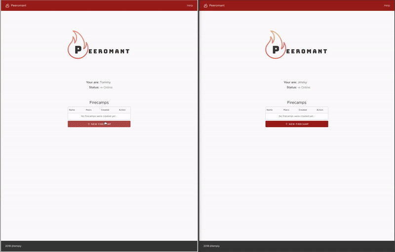

# Peeromant :fire:

### P2P File transfer web application

#### About

Peeromant is peer-to-peer browser-based file transfer system built on top of
[WebRTC](https://webrtc.org/) . Project is on development stage, currently provides following
possibilities/features. 

* User-to-user file streaming without having to upload your data to server/broker

* User-to-group file streaming with possibility to select bunch of files

* Simple, zero-authorization workflow

Preview:

***No-server remark:*** In order to recognize connection addressee WebRTC apps are using
[STUN/TURN and signalling servers](http://html5rocks.com/en/tutorials/webrtc/infrastructure/). So they are **not** fully client-side apps. Its important 
to understand that transferred data (user files) will never be uploaded to mentioned servers.

#### Technologies stack

##### STUN
* Public Google STUN/TURN servers

##### Signaller

* Golang 1.10
* Echo
* Gorilla WebSockets

##### Application
* Typescript
* Angular 6
* Rxjs 6
* VMWare Clarity UI

#### How to start dev
1. Clone, compile and run signal server from this [repo](https://github.com/lempiy/Signaller).
2. Clone application [repo](https://github.com/lempiy/Peeromant).
3. Install dependencies `npm install`
4. Start app `npm start`

#### Any questions?
Ask me using Github issues
